---

<div align="center">

[](https://git.io/typing-svg)

[](https://xtofuub.github.io/)

</div>

---

## `whoami`

```console
┌──(edwin㉿kali)-[~]
└─$ whoami

  name      →  Edwin
  role      →  Cybersecurity Specialist Jr
  focus     →  Security  /  Full Stack Dev  /  Reverse Engineering

  security  →  web pentesting, OSINT, CTI, malware analysis workflows
  rev_eng   →  reverse engineering, iOS app analysis, Frida instrumentation
  building  →  if something doesn't exist and I need it, I build it
  stack     →  TypeScript, React, Next.js, Node.js, Python, PowerShell, PHP
  tools     →  Kali, Burp Suite, Nmap, Wireshark, Frida, Triage, Shodan, Maltego
  vibe      →  "learn by breaking, build by doing"

┌──(edwin㉿kali)-[~]
└─$ █
```

---

## `current_focus`

```python
class Edwin:
    def __init__(self):
        self.currently_learning = [
            "Reverse Engineering",
            "Malware analysis + CTI reporting",
            "iOS pentesting with Frida",
            "Python scripting + tooling",
            "PowerShell automation",
            "Linux and Windows internals",
            "Web app security",
            "Full-stack security products"
        ]
        self.currently_building = [
            "Security tools",
            "AI-assisted analysis workflows",
            "Full stack web apps",
            "Browser extensions",
            "Internal dashboards and security UIs",
            "Random stuff that seems useful"
        ]
        self.vibe = "learn by breaking, build by doing"
```

---

## `tech_stack`

**Languages**


**Frontend, Backend & Product UI**


**Cybersecurity, Malware Analysis & CTI**


**Systems, Cloud & Infrastructure**


---

## `featured_projects`

<details open>
<summary>🔴 Offensive Security & Red Team</summary>
<br>

| Project | Description | Tech |
|---------|-------------|------|
| [RavenC2](https://github.com/xtofuub/RavenC2) | PowerShell C2 tool for managing a Windows machine via Telegram - built for automation experiments and authorized remote administration | `PowerShell` |
| [PacketStorm](https://github.com/xtofuub/PacketStorm) | Semi-automated Python deauther for Kali Linux lab environments | `Python` `Kali Linux` |
| [PS-CredentialPhisher](https://github.com/xtofuub/PS-CredentialPhisher) | PowerShell utility for testing Windows CredUI behavior and UAC prompt simulations - security research and authentication workflow testing | `PowerShell` |
| [mailsploit](https://github.com/xtofuub/mailsploit) | Security-focused email platform demonstrating advanced spoofing techniques while analyzing SPF and DMARC - built for defensive testing | `Python` |
| [SpoofMail](https://github.com/xtofuub/SpoofMail) | Modern responsive email spoofing UI with file attachment support, previews, and smooth animations | `PHP` `HTML` `CSS` `JS` |
| [wilma-phish](https://github.com/xtofuub/wilma-phish) | Wilma phishing clone for authorized awareness and security testing demonstrations | `HTML` |
| [XSwitch](https://github.com/xtofuub/XSwitch) | Security / utility project from my lab collection | `Security` `Utility` |
| [wifi-upgrade-illusion-master](https://github.com/xtofuub/wifi-upgrade-illusion-master) | Wireless security themed UI / testing project | `Web` `Security` |

</details>

<details open>
<summary>🧠 Malware Analysis, Reverse Engineering & iOS Research</summary>
<br>

| Project | Description | Tech |
|---------|-------------|------|
| [Sentinel-VOIP](https://github.com/xtofuub/Sentinel-VOIP) | Reverse-engineering of the Juasapp VoIP protocol using a jailbroken iOS device - signaling flows extracted via dynamic runtime analysis and rebuilt from scratch | `JavaScript` `iOS` `Frida` |
| [PysilonDecoder](https://github.com/xtofuub/PysilonDecoder) | Analyzes and decodes Pysilon malware tokens - automates extraction, identifies encoding algorithms, and reconstructs the original payload | `Python` |
| [Hashtrace](https://github.com/xtofuub/Hashtrace) | Lightweight Chromium extension that highlights cryptographic hashes on web pages and fetches VirusTotal reputation inline | `JavaScript` `VirusTotal` |
| [REVios-AI](https://github.com/xtofuub/REVios-AI) | AI-assisted iOS reverse engineering and jailbreak analysis workspace concept | `TypeScript` `AI` `iOS` |
| [ios-jailbreak-ssh-mcp](https://github.com/xtofuub/ios-jailbreak-ssh-mcp) | MCP-style bridge concept for interacting with jailbroken iOS files over SSH in authorized environments | `TypeScript` `SSH` `MCP` |
| [Veil-AI](https://github.com/xtofuub/Veil-AI) | AI binary analysis / reverse engineering landing page concept | `HTML` `CSS` `JS` |
| [Melani-AI](https://github.com/xtofuub/Melani-AI) | Landing page for an AI-native browser-based reverse engineering analyst concept | `Landing Page` `AI` |

</details>

<details open>
<summary>🌐 Web Tools, Dashboards & Full Stack Development</summary>
<br>

| Project | Description | Tech |
|---------|-------------|------|
| [RevOps-Dashboard](https://github.com/xtofuub/RevOps-Dashboard) | Weekly RevOps metric tracking with analytics, critical signal detection, and executive summaries - live on Vercel | `TypeScript` `Next.js` `Supabase` |
| [fitsec-focus-coach](https://github.com/xtofuub/fitsec-focus-coach) | Internal employee management platform for FitSec - monitors work sessions, manages break times, and tracks daily productivity | `TypeScript` |
| [fitsec-usbguard](https://github.com/xtofuub/fitsec-usbguard) | USBGuard UI revamp with Framer and Liquid Glass effects - high-performance animations and professional security-themed design | `TypeScript` `UI` |
| [SMBitan](https://github.com/xtofuub/SMBitan) | Dark-themed web UI for browsing, searching, and previewing files on SMB/UNC network shares | `JavaScript` `Python` `Flask` |
| [Solveify](https://github.com/xtofuub/Solveify) | Browser extension that uses the Gemini API to instantly analyze highlighted questions and retrieve answers - supports multiple choice and open-ended queries | `JavaScript` `Browser Extension` |
| [NyxRepost](https://github.com/xtofuub/NyxRepost) | Advanced TikTok repost analytics dashboard with charts, word clouds, creator stats, and profile comparison via TikTok API scraper | `HTML` `JS` |
| [xtofuub.github.io](https://github.com/xtofuub/xtofuub.github.io) | Personal portfolio website | `HTML` `CSS` `JS` |
| [internspark-connect](https://github.com/xtofuub/internspark-connect) | Internship / career connection web application concept | `Web App` |
| [lastfm-yearning](https://github.com/xtofuub/lastfm-yearning) | Music / Last.fm inspired web project | `Web` `API` |
| [literate-octo-meme](https://github.com/xtofuub/literate-octo-meme) | Experimental web project from my build lab | `Web` |
| [DSADSAD](https://github.com/xtofuub/DSADSAD) | Experimental frontend / web project | `Web` |
| [Affinity](https://github.com/xtofuub/Affinity) | Large experimental product / interface project | `Web` `UI` |

</details>

<details open>
<summary>📚 Research, Resources & Creative</summary>
<br>

| Project | Description | Tech |
|---------|-------------|------|
| [Cyber-Resources](https://github.com/xtofuub/Cyber-Resources) | Curated collection of cybersecurity, OSINT, malware analysis, reconnaissance, and threat-intel resources I personally use | `Docs` |
| [Wallpapers](https://github.com/xtofuub/Wallpapers) | Wallpaper and visual asset collection | `Design` |
| [image](https://github.com/xtofuub/image) | Image / asset repository | `Assets` |
| [tofuub](https://github.com/xtofuub/tofuub) | Profile / identity repository | `GitHub` |

</details>

---

## `stats`

<div align="center">

[](https://github.com/xtofuub)

[](https://tryhackme.com/p/Tofuub)

</div>

---

## `contribution_grid`

<div align="center">

[](https://github.com/xtofuub)

</div>

---

<div align="center">


</div>
