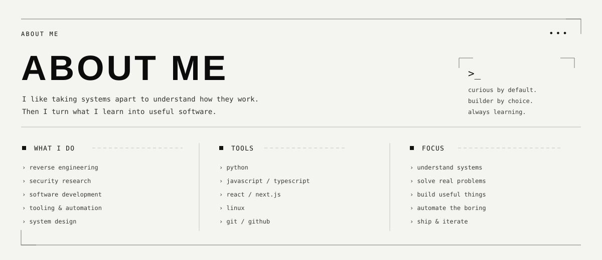

  

 

### about

I like taking systems apart to understand how they work — then turning what I learn into useful software.

Most of my time goes into **reverse engineering**, **security research**, **software development**, and building small tools that solve real problems.

`reverse engineering` &nbsp; `security` &nbsp; `software` &nbsp; `tooling` &nbsp; `automation`

 

<table width="100%">
<tr>
<td width="33%" valign="top">

**01 / UNDERSTAND**

Look below the abstraction and figure out what is actually happening.

</td>
<td width="33%" valign="top">

**02 / BUILD**

Turn the useful parts into focused software instead of oversized systems.

</td>
<td width="33%" valign="top">

**03 / LEARN**

Keep moving into unfamiliar systems, tools, formats and protocols.

</td>
</tr>
</table>

 

### activity

  

The activity panel is generated automatically from GitHub and refreshed daily. It contains no manually entered personal profile details.
