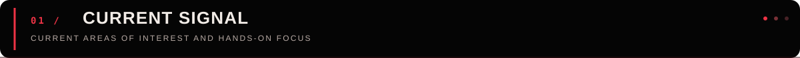
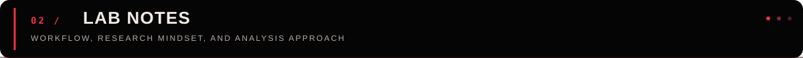
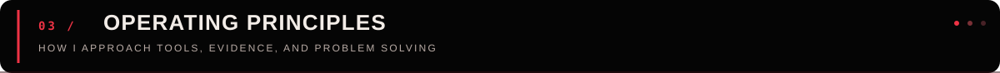
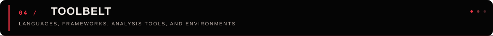
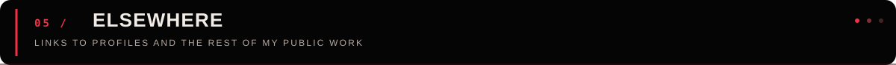
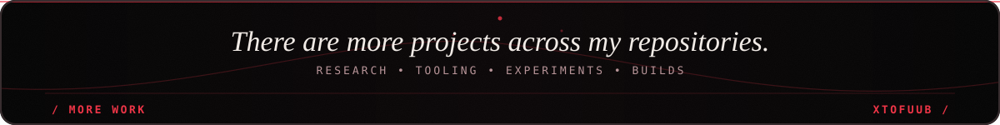

<br>

<div align="center">

### Building practical security tools and studying how systems break.

`Reverse Engineering` · `Malware Analysis` · `Security Tooling` · `DFIR` · `iOS Research`

</div>



<table>
<tr>
<td width="33%" valign="top">

### ◉ Reversing

Mach-O, PE, loaders, packers and malware artefacts.

</td>
<td width="33%" valign="top">

### 〰 Runtime

Frida instrumentation, application behaviour and runtime internals.

</td>
<td width="33%" valign="top">

### ◇ Tooling

Small tools that remove friction from triage and analysis.

</td>
</tr>
</table>



```text
BEHAVIOUR  / Follow what the software does, not what it claims.
WORKFLOW   / Repetitive analysis steps should eventually become tools.
RESEARCH   / Understand the system before trying to automate it.
```



<table>
<tr>
<td width="33%" valign="top">

<sub>01</sub>

### Understand before automating

Know the system first. Improve it second.

</td>
<td width="33%" valign="top">

<sub>02</sub>

### Prefer evidence over assumptions

Observe behaviour, reproduce it, then document it.

</td>
<td width="33%" valign="top">

<sub>03</sub>

### Build tools that stay useful

Solve real friction and keep the interface simple.

</td>
</tr>
</table>



<div align="center">

`Python` · `TypeScript` · `JavaScript` · `PowerShell` · `PHP` · `SQL` · `Bash`

`Frida` · `Ghidra` · `radare2` · `YARA` · `Sigma` · `Burp Suite` · `Wireshark` · `Nmap` · `Nuclei` · `ffuf` · `mitmproxy`

`React` · `Next.js` · `Node.js` · `Flask` · `Tailwind CSS` · `shadcn/ui` · `Supabase` · `Vercel`

`Linux` · `Windows` · `iOS` · `Docker` · `Git` · `Azure` · `Active Directory` · `MySQL` · `Kali Linux`

</div>



<div align="center">

[**TryHackMe ↗**](https://tryhackme.com/p/tofuub) &nbsp;&nbsp;·&nbsp;&nbsp; [**More projects ↗**](https://github.com/xtofuub?tab=repositories)

<br>

<sub><em>There are more projects across my repositories.</em></sub>

</div>

<br>


